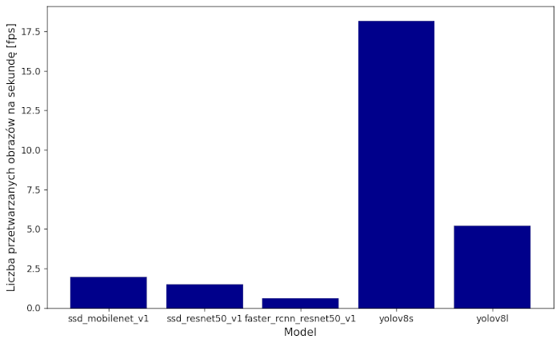

# Emergency Vehicle Detection: A Comparative Analysis of TensorFlow and YOLO Models

The primary objective of this project was to assess and compare the performance of pretrained models from TensorFlow, including Faster R-CNN ResNet50 V1, SSD MobileNet V1, and SSD ResNet50 V1, alongside models provided by Ultralytics, namely YOLOv8s and YOLOv8l. The evaluation was conducted on a dataset comprising 1162 images featuring various types of emergency vehicles, which served as the training and testing ground for these models.

## Model Comparison:
The following pretrained models were evaluated:
- Faster R-CNN ResNet50 V1
- SSD MobileNet V1
- SSD ResNet50 V1
- YOLOv8s
- YOLOv8l

## Evaluation Metrics:
To comprehensively assess model performance, a script was developed to generate a confusion matrix and calculate key metrics such as precision, recall, F1 score, and Intersection Over Union (IoU). Among the models, YOLOv8s demonstrated superior efficiency, likely due to its lightweight architecture, preventing overfitting on training images. The calculated metrics for YOLOv8s are presented in the tables below:

## Speed and Accuracy Comparison:
Additionally, the speed and accuracy of these models were compared, with the results illustrated in the graph below:

## Interactive Website:
As a culmination of the project, an interactive website was developed using Flask. This platform allows users to test the YOLOv8s model's ability to detect police, fire trucks, and ambulances. A snapshot of the website is provided below:

